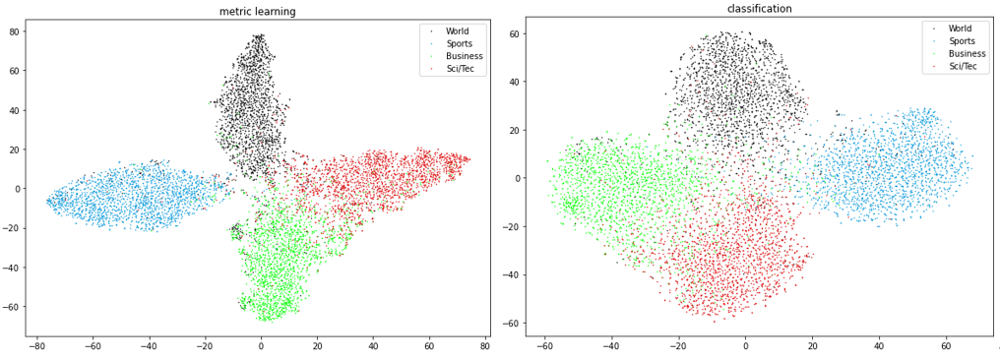
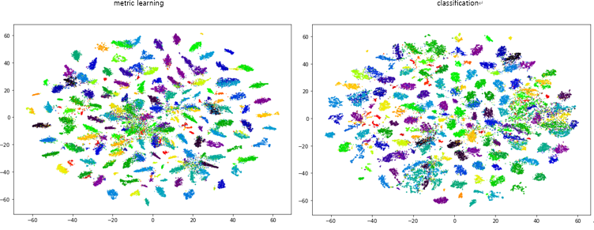
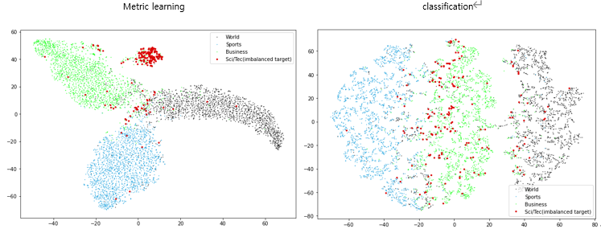
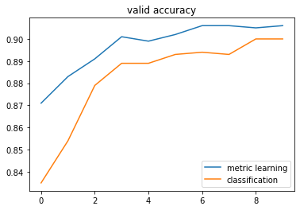

# classification vs metric learning

### 1. Introduction

However, in the case of metric learning learning, since the learning time is relatively longer than that of the classification task, the efficiency of the learning itself is lowered.

Accordingly, we visually check through visualization what kind of embedding cluster the toy data learned according to classification and metric learning form, and in which cases metric learning can be more effective than classification.

For reference, the experiment is based on text data, and the experimental results may be different for the image area or other areas.

And, I'm not going to check performance with accuracy or precision etc for this experiments. It might be further research, but not main interests. 

### 2. Dataset
There are two datasets used in the experiment: AG_NEWS and DBpedia. Both datasets are datasets for classification and can be downloaded with torchtext. Simple description of data is as below.

|           | AG_NEWS | DBPedia |
|-----------|---------|---------|
| num_class | 4       | 219     |
| num_train | 120000  | 240942  |
| num_test  | 7600    | 60794   |

### 3. Hyper-parameter
hyperparameter settings were same for both
- epoch : 10
- embed_dim : 32
- batch_size : 64
- loss function : 
    - classification : cross-entropy loss
    - metric learning : triplet loss (margin=0.2)
    
### 4. Preprocessing
I used torchtext.data.utils.get_tokenizer with 'en' option. It just normalizes the string and split with space.

### 5. Model
Since this experiment is for comparison of learning methods, not evaluation of model performance, a simple MLP was created for ease of experimentation.

```python
class TextClassificationModel(nn.Module):

    def __init__(self, vocab_size, embed_dim, num_class):
        super(TextClassificationModel, self).__init__()
        self.embedding = nn.EmbeddingBag(vocab_size, embed_dim, sparse=True) # embedding + averaging
        self.fc = nn.Linear(embed_dim, num_class)
        self.init_weights()

    def init_weights(self):
        initrange = 0.5
        self.embedding.weight.data.uniform_(-initrange, initrange)
        self.fc.weight.data.uniform_(-initrange, initrange)
        self.fc.bias.data.zero_()

    def forward(self, text, offsets):
        embedded = self.embedding(text, offsets)
        return self.fc(embedded)
```

### 6. Visualization 

first, I used T-SNE visualization to check/compare the embedding cluster from two methods.
Of course, all visualizations are used only through the test dataset, which is not used for training.

### 7. Normal case
normal case means there is no option in this setting. just uses whole given dataset without manipulation.

Both methods seem to form an embedding cluster for labels well. However, in the case of metric learning, it seems that the distance between instances with the same label feature is closer. Not only through visualization, but looking at the dataframe below, in the case of metric learning, it can be seen that the cosine similarity between embeddings with the same label feature is higher than that of classification.

Accordingly, it means that metric learning has a higher cohesion between embedding clusters. How these results will affect semi-supervised learning will be discussed further later.

#### 7-1. AG_NEWS

| label/cosine_sim | Classification | Metric Learning |
|-|-|-|
| 0 | 0.44 | 0.61 |
| 1 | 0.52 | 0.72 |
| 2 | 0.38 | 0.58 |
| 3 | 0.28 | 0.65 |
| average | 0.41 | 0.64 |



#### 7-2. DBPedia

In the case of DBPedia, since the number of labels is large, the dataframe format showed statistics of cosine similarity assigned to each of 216 labels, not cosine similarity per label.

Interestingly, this time, in the case of classification, the embedding cluster showed higher cohesion, and this trend was the same when working with an increased epoch.

Accordingly, in my experiment, when there are many labels, classification has more superiority than metric learning in terms of cohesion of embedding cluster.

| cosine similarity <br>within same cluster | Classification | Metric Learning |
|-|-|-|
| mean | 0.79 | 0.71 |
| std | 0.07 | 0.09 |
| min | 0.48 | 0.38 |
| 25% | 0.74 | 0.66 |
| 50% | 0.79 | 0.73 |
| 75% | 0.84 | 0.78 |
| max | 0.94 | 0.89 |



### 8. Imbalanced data case

This time, we are going to investigate the case where the distribution of label features of the data is imbalanced. The criteria for coping well with imbalanced data are set as follows.
- Are the relatively small embedding clusters well separated from other clusters?
- Is it possible to distinguish between insufficient label features?

#### 8-1. AG_NEWS

In the case of AG_NEWS, since it is a balanced dataset, one label was randomly selected among them, and only 10% of the data number of the other labels was used. In the figure below, the red dot means a label insufficient, and the result was maintained for all label features.

Now, looking at the results, it can be seen that the trend is clearly visible. In the case of metric learning, it can be seen that the insufficient label set is well distinguished from other label sets, and the cluster cohesion is high.

In the case of the data, it can be said that metric learning forms embedding clusters much better than classification on imbalanced data.



#### 8-2. DBPedia

The histogram below counts the number of data assigned to each label of the DBPedia dataset, and since the larger and smaller sides differ by approximately 10 times, it was determined that imbalance exists by itself.


When I sorted the data with the insufficient label set in the DBPedia dataset by the number of labels, I picked 30 tails and the scatter plot below is the result of visualizing only those values.

As you can feel, the visualization did not provide enough information, so we compared the two methodologies through 3 indicators.

As a result of looking at the three indicators below, classification in the DBPedia dataset is effective for approximating embeddings within the same label feature, but metric learning seems to be effective for estimating different label features from each other.


##### 8-2-1. Do the same embedding clusters (only for in-sufficient) show high cosine similarity?
- `large` value means better


##### 8-2-2. Is it (in-sufficient) distinguishable from other embedding clusters?
- cosine similarity between centroid of in-sufficients (mean vector) and sufficient embedding clusters
- `small` value means better


##### 8-2-3. Are insufficient embedding clusters distinguishable from each other?
- `small` value means better


### 9. Semi-supervised learning case

In this section, we perform the task of predicting AGG_NEWS using embeddings learned from the DBPedia dataset.
Through this task, it is expected that each methodology will be able to check how much more general information can be captured. To check the performance of pretrained embeddings, classification was used as a fine tuning task.

I also used MLP in this time, but dropout and batch normalization layer were added

```python
class FineTuningModel(nn.Module):

    def __init__(self,
                 n_embed=10000,
                 d_embed=32,
                 d_hidden1=64,
                 d_hidden2=4,
                 d_out=2,
                 dp=0.2,
                 pretrained=None):
        super(FineTuningModel, self).__init__()
        
        self.embed = pretrained
        self.dropout1 = nn.Dropout(dp)
        self.bn1 = nn.BatchNorm1d(d_embed)
        self.fc1 = nn.Linear(d_embed, d_hidden1)
        self.dropout2 = nn.Dropout(dp)
        self.bn2 = nn.BatchNorm1d(d_hidden1)
        self.fc2 = nn.Linear(d_hidden1, d_hidden2)

    def forward(self, text):
        x = self.embed(text)

        x = self.dropout1(x)
        x = self.bn1(x)
        x = self.fc1(x)
        x = self.dropout2(x)
        x = self.bn2(x)
        x = torch.tanh(self.fc2(x))

        return x
```

The results of fine tuning were as follows. In the case of AG_NEWS fine tuning, metric learning was better. Accordingly, some more assumptions can be made for further research. And we will leave these for future research.



##### 9-1. Is classifying embedding clusters more helpful for fine-tuning?
##### 9-2. How does high cohesion between the same embedding clusters affect fine-tuning?

# 10. Conclusion

"Classification is a Strong Baseline for Deep
According to the study of "Metric Learning" Zhai, 2019, when solving a classification task using normalized embedding, it has been shown that embedding retreival performance is superior to that of metric learning methodology.

In addition to the above study, my experiment this time showed that the classification method showed similar performance to metric learning overall except for the imbalanced dataset in the metric learning task.

In addition, the important thing in model learning is not only performance, but also performance-to-performance and learning time and memory required.