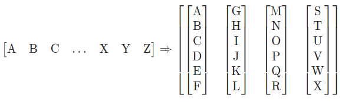
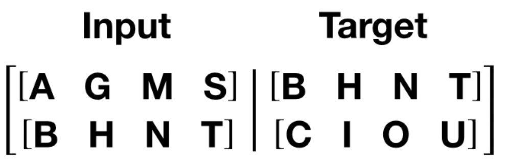

# Data iterator for Language Modeling

### 1. Introduction

If you look at the language modeling part of the [pytorch tutorial](https://pytorch.org/tutorials/beginner/transformer_tutorial.html), for effective batch processing, 
the sentences are cut according to the batch size as shown below, and the source/target word index is returned while sliding.

In fact, the torchtext package provides the iterator, but by implementing the code directly, I made a custom class to learn it.
In addition, it is expected that the effect will not be large, but an option to shuffle the order of the training data every epoch was also put.

Finally, to improve model performance and speed, huggingface tokenzier is used iternally. However, since this method generates a package dependency, a vanilla option that supports simple tokenization based on pure Python will be added in the future.
