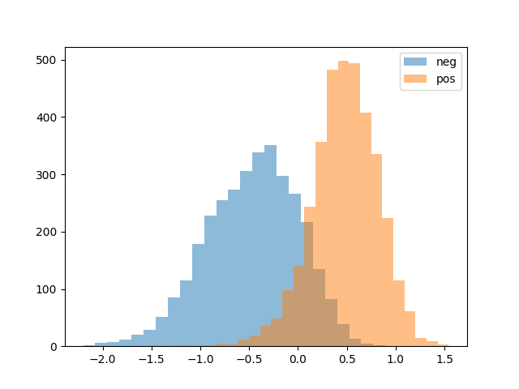
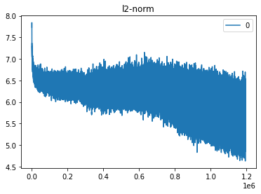
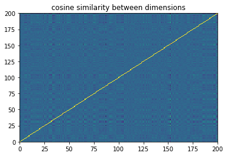
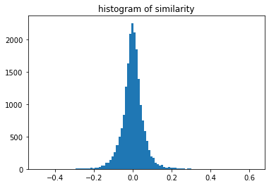
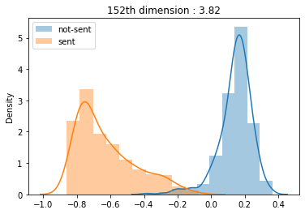
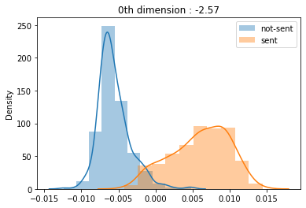
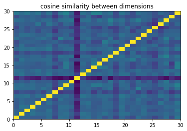
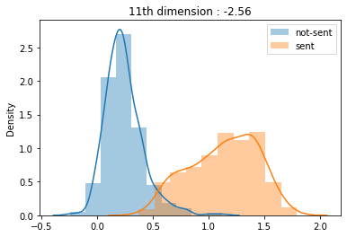

# Discover sentiment from word embedding

### 1. Introduction & Motivation

Looking at the paper ["Learning to Genearte Reviews and Discovering Sentiment[1]"](https://arxiv.org/abs/1704.01444), 
it is said that there is a single unit that distinguishes sentiment among the sentence vectors generated through language modeling.
If you look at the [github implementation](https://github.com/openai/generating-reviews-discovering-sentiment/blob/master/sst_binary_demo.py#L19), you can see that the 2388th unit serves as a feature that distinguishes positive and negative review data along with the image attached to the paper.



In contrast to these results, the paper ["Intriguing properties of neural networks[2]"](https://arxiv.org/pdf/1312.6199.pdf) 
states that "the individual units of the vector representations are unlikely to contain semantic information".
 It uses representation, and it is said that it is difficult for the hidden unit to have semantic information in the vector representation,
  and the latent representation of a general neural network is "entangled" with a simple experiment.
 
Reading these two papers, I tried to detect a single unit in which semantic information exists, 
using a pretrained word vector that is post-processed in some cases, and the true result will be somewhere in the middle of these two arguments.

Recently, according to many studies on disentangled embedding, 
it is possible to learn a single unit or partial space that can distinguish semantic information with an end-to-end scheme, but in practice, it is relatively expensive to learn.
Accordingly, it is considered practically meaningful for a researcher to select and weight features through feature engineering.
Above all, this feature-engineering is expected to have a positive effect on the understanding and interpretation of the model results.

### 2. Model

I downloaded the pre-trained word embedding from gensim named "glove-twitter-200"

### 3. Post-processing 

1. vanilla 
    - there is no post-processing

2. SVD
    - applied singular value decomposition to do factor analysis since svd gives orthogonal vector space
    - I whiten the original embedding and truncate dimension til 90% variance explanatory power.
    - I also normalized eigenvalue term for mitigating the effect of variance scale from each dimension 
    
3. Auto-Encoder
    - Non-linear dimensionality reduction
    - it doesn't support orthogonal PC but expect to give us non-linear manifold

### 4. Check pre-trained word embeddings
1. vector norm
    - the l2 norm of word vector depends on word frequency and consistency of emergence.
    - since gensim's vocab is sorted with word frequency, below image's result is expected
    - to prevent the effect of vector norm, I normalized them.
 
```python
from sklearn.preprocessing import normalize
vectors = normalize(vectors, axis=1)
```


2. similarity between dimension
    - Since the objective of the experiments is to detect the feature is able to distinguish the semantic information, orthogonality between feature supports better factor analysis
    - They can be said to be mutually independent, which is often unexpected given the premise that the pretrained embedding vector is entangled. I think it is the result of using a relatively large embedding dimension.
    - Anyway, they're pretty independent, so I don't expect them to be a big problem for factor analysis.
    



# 5. Extract Sentiment words

- For both positive and negative, the init word was set arbitrarily, and words close to the seed word were stored in the container through iteration while limiting the similarity value. Please refer to the source code for details
- Looking at the statistics below, as is already known, the intersection count between pos/neg shows a high ratio, word embedding shows a tendency not to catch words of positive and negative sentiment well.

| The Number of picked |  |
|---|---|
| positive words picked  | 282 |
| negative words picked | 384 |
| sentimental words picked | 441 |
| intersection between pos/neg | 225 |

# 6. Discover sentiment feature from embedding
As in the previous paper [1], sentimental dimension is found through histogram visualization, which is a visual and simple method. In addition, several experiments were added, as follows.

1. Histogram difference between sentimental words and non-sentimental words
2. Histogram difference between positive words and negative words
3. Quantification of distribution differences by z-test


### 6.1. Is there sentimental feature within word embedding?

#### Vanilla version
It seems so. According to z-test, distributions from non-sentimental and sentimental can be said different statistically. 
Also I divided the 152th dimension's value with heuristic boundary by referring plot. below is pseudo function 
```python
def divide(x) :  
    if x > -1 and x < -0.6 : 
        return 'sentimental'
    elif x > 0 and x < 0.4 : 
        return 'non-sentimental' 
``` 
and 19.64% of words from sentimental label have sentiment score from nltk vader but only 0.14% from non-sentimental
   


#### SVD version
Through histogram analysis, the first PC was extracted as above, and when the same statistics as the vanilla version were issued,
 8.04% for the sentimental boundary of the axis and 0.01% for the non-sentimental boundary.


#### Auto-Encoder version
First, you can see that each dimension of the auto-encoder is highly correlated, unlike the vanilla and svd versions.
 This seems to be due to explicitly applying non-linear operation in the auto encoder learning process, and it can be said that it is more entangled than other embeddings.
 



The sentimental axis could also be found here, and the results according to the boundary were sentimental: 6.88% and non-sentimental: 0.23%, respectively.



### 6.2. Is there sentimental feature within word embedding?
Overall embeddings couldn't distinguish positive and negative sentiment words. I think that it is from characteristics of word embedding  that it is not good at antonyms.

# 10. Conclusion

When designing the experiment, it was expected that manifold learning such as svd or auto encoder would be helpful in finding hidden units that discriminate semantic information.
However, it was confirmed that this tendency decreased as post-processing was applied to the embedding of vanilla version.
What was surprising was that the explained variance ratio obtained through svd was very imbalanced (the variance of the first PC was about 86%).
Due to this part, a variance domination problem occurred, making it more difficult to identify informative axes.

Also, according to the words of the previous study [2], the output of the neural network on which the non-linear operation is stacked becomes more and more entangled,
 and accordingly, it can be seen that it is increasingly difficult to extract semantic information from the hidden unit.
 
| The Number of picked | vanilla | svd | auto encoder |
|---|---|---|---|
| sentimental boundary ratio (%) | 19.64 | 8.04 | 6.88 |
| non-sentimental boundary ratio (%) | 0.14 | 0.01 | 0.23 |
| z-test (high is better) | 3.82 | 2.57 | 2.56 |
