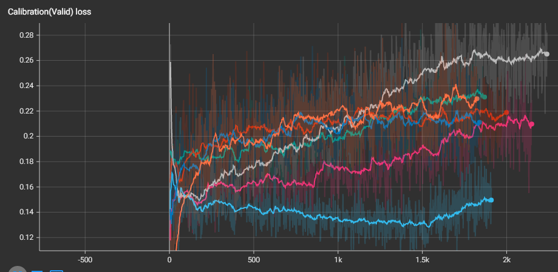

# Model Calibration

### 1. Introduction & Motivation
Model calibration is a technique that makes the predicted probability returned by the machine learning model express the actual likelihood of correctness.
This model calibration is an essential element for using machine learning in the medical and financial fields, 
which are sensitive to uncertainty, and since a model that can express it well can be said to have good generalization, 
it is closely connected with the model's performance. .
Accordingly, we will review the papers in the relevant field and implement and share the process of implementing it. 
The thesis review can be found on my [personal blog](https://techy8855.tistory.com/29), unfortunately, it is in Korean.

### 2. Model

0. Predicting Good Probabilities With Supervised Learning
1. On Calibration of Modern Neural Networks
2. Calibrating Deep Neural Networks using Focal Loss
3. On Mixup Training: Improved Calibration and Predictive Uncertainty for Deep Neural Networks
4. When Does Label Smoothing Help?
5. Regularizing Neural Networks By Penalizing Confident Output Distributions
    
### 3. Metrics
The calibration error is the measured difference between the predicted probability of the model and the corresponding true probability.
 For example, if the model samples 100 datasets allocated with a probability of [0.7, 0.8) for class 1, 
 and the ratio of class 1 data among them is 0.6, then 0.1 is the calibration loss.

0. Expected Calibration Error (ECE)

1. Max Calibration Error (MCE)

2. Adaptive Calibration Error (ACE)


### 4. Results
If you want to check the results in detail, please check the results with opening the tensorboard using  the command ```tensorboard --logdir=runs``` 

The options for the models used are listed below. 
For reference, the model training was conducted for about 20 epochs due to resource limitations,
 so it cannot be said that the model has converged, and it seems that there is a limit to the reliability 
 of the interpretation of the results.

**model options**


Below are the values ​​for each batch of performance indicators visualized with tensorboard. Since hyperparameter tuning was not performed, it is a validation dataset, but it can be regarded as a test dataset. Looking at the calibration loss plot at the bottom, it can be seen that mix-up and focal loss show relatively good calibration performance, and focal loss dominates overall.

**validation accuracy**


**validation loss**


**classwise-ECE**


In the above plot, we only see classwise-ECE (umean/umax in the legend below) where the predicted probability is binned by 0.1, so it is together with classwise-ACE (meaning qmean/qmax in the legend below) taking into account the distribution of the predicted probability. saw. In addition, to use the sigmoid scaling discussed in Part 2, a validation dataset was used, and accordingly, the performance indicators below are through the test dataset.

 Unexpected results were obtained, and sigmoid scaling took the lead in all calibration performance indicators. On the other hand, the log loss has the worst value (the highest value), which seems to be because the model has the highest classifiation error.

In the validation dataset above, the use of focal loss was the best, but in the case below, it can be seen that the mix-up is superior. In the case of mix-up, both log-loss and accuracy had the highest scores, and the calibration error also shows the performance of Top-2, which is not far behind Top-1, sigmoid scaling, so mix-up is the most attractive method as a result. see.
 
Overall, the use of a methodology called effective for calibration always results in better calibration performance than if it were not.

**Overall performance**

